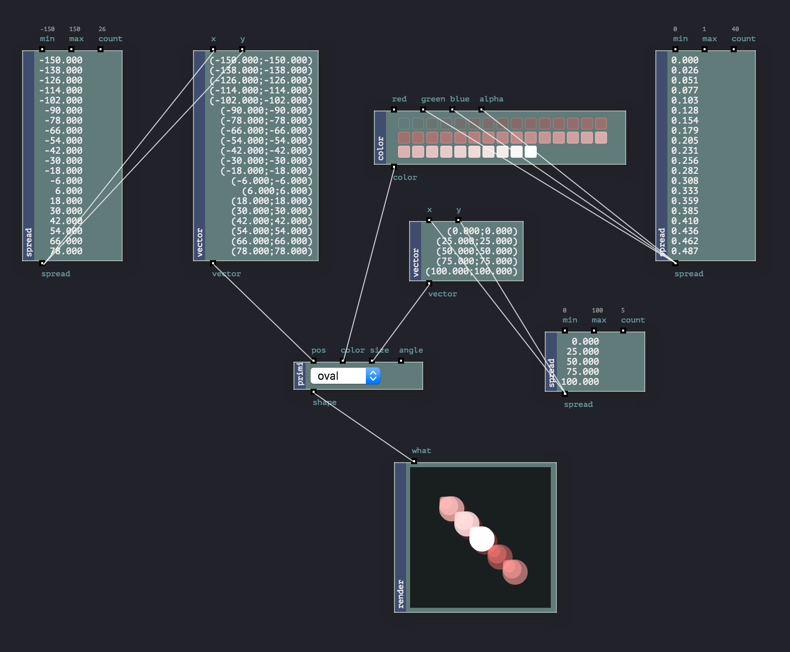
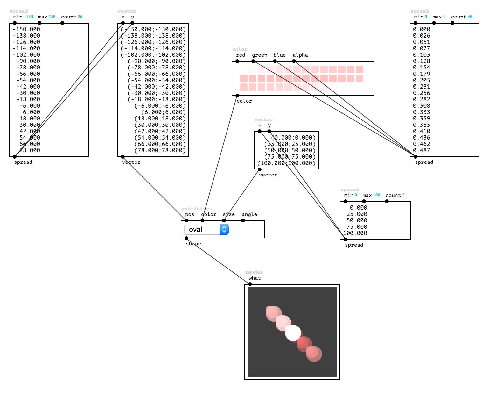
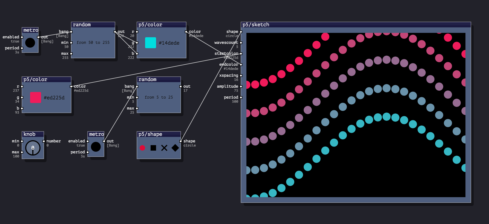
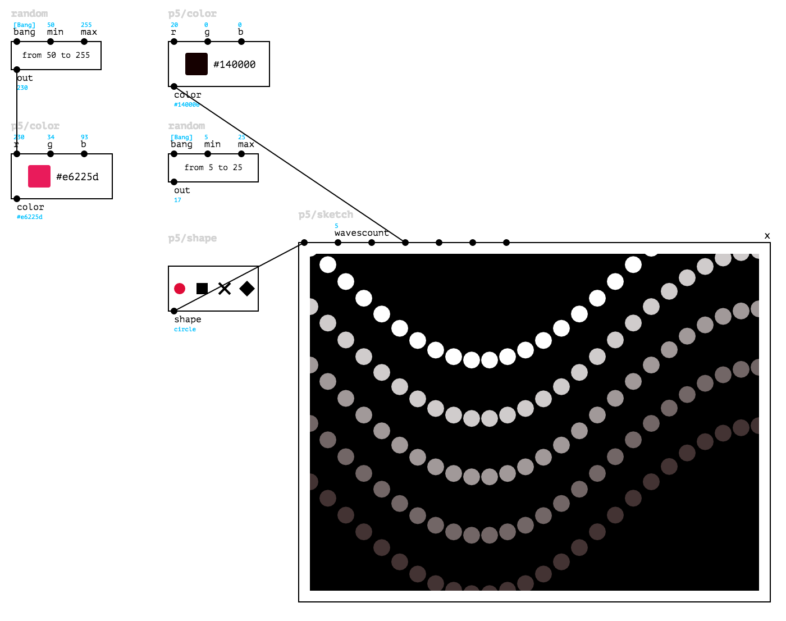
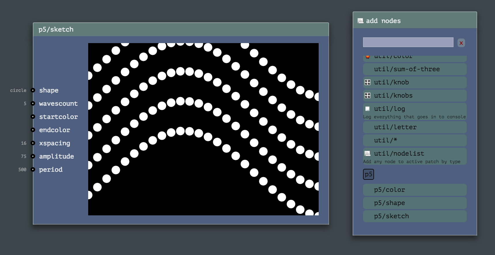
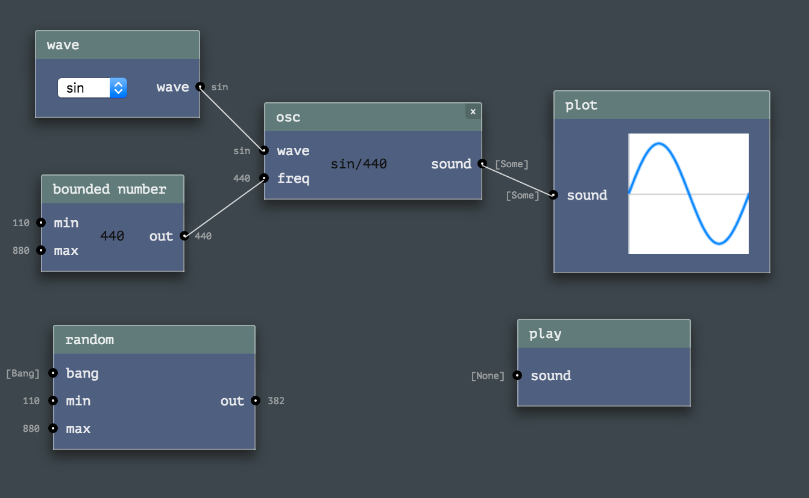
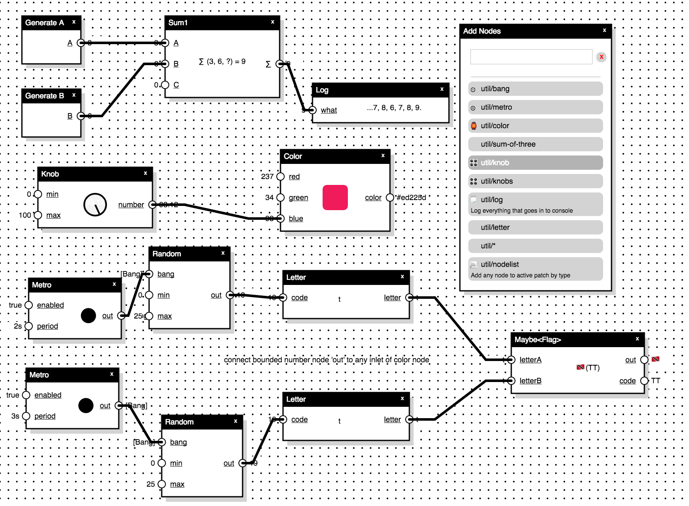
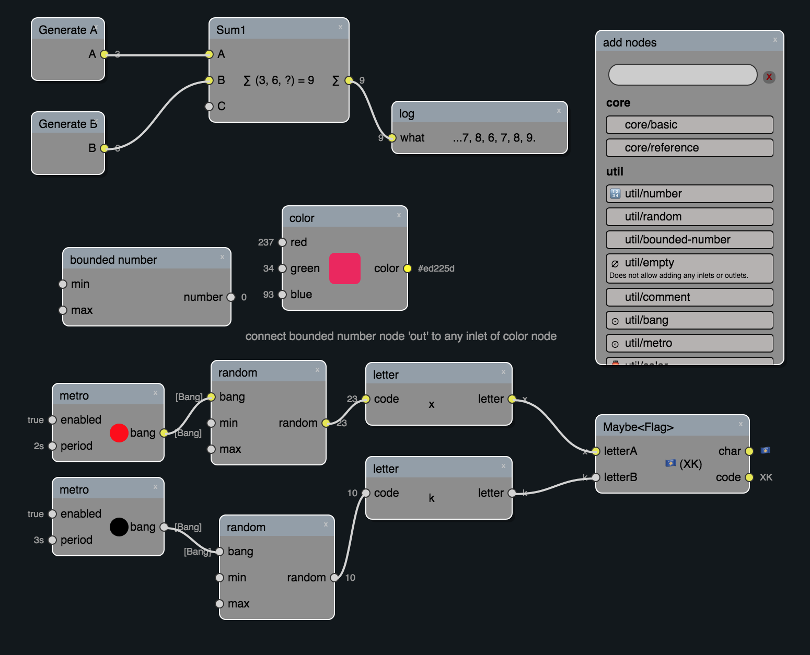
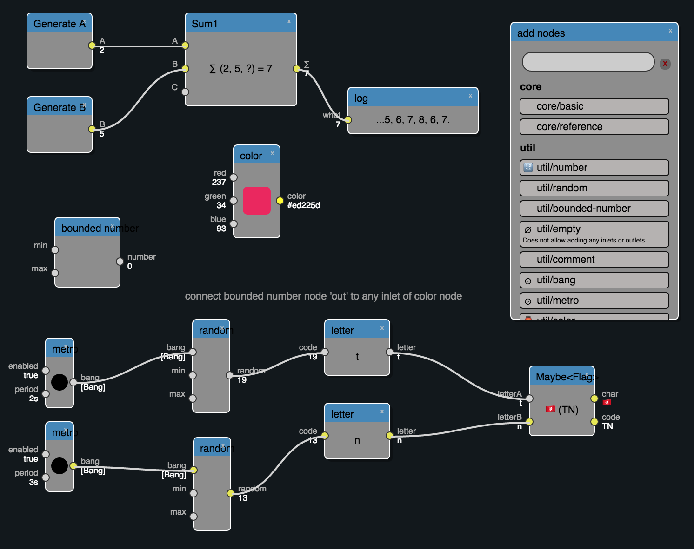
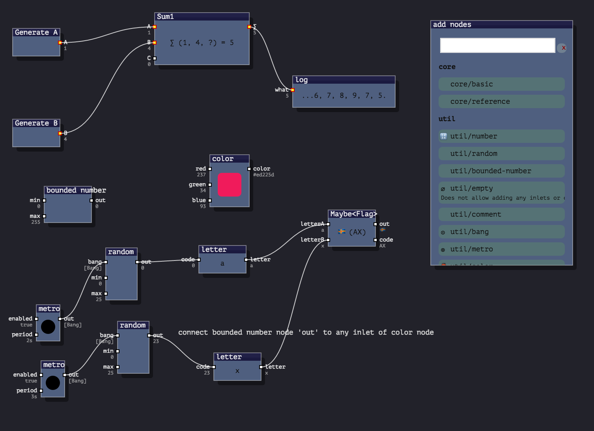

NB: Versions of RPD used in these examples may appear not to be up-to-date, please use the methods described on [Setup page](./sections/setup.html) to ensure you get the latest one.

* Animatron toolkit, <code>compact</code> style, HTML 
* Animatron toolkit, <code>plain</code> style, HTML 
* Animatron toolkit, <code>pd</code> style, HTML 
* Pure Data toolkit, <code>webpd</code> style, SVG 
* Processing toolkit, <code>compact-v</code> style, SVG 
* Processing toolkit, <code>compact</code> style, SVG 
* Processing toolkit, <code>plain</code> style, SVG 
* Processing toolkit, <code>quartz</code> style, HTML 
* Timbre toolkit, <code>quartz</code> style, HTML 
* Util toolkit, <code>black-white</code> style, SVG 
* Util toolkit, <code>ableton</code> style, SVG 
* Util toolkit, <code>ableton-out</code> style, SVG 
* Util toolkit, <code>blender</code> style, SVG 
* Util toolkit, <code>compact-v</code> style, SVG 
* Util toolkit, <code>quartz</code> style, SVG 
* Util toolkit, <code>quartz</code> style, HTML 

<!-- TODO: example for every style with every possible renderer -->

#### Videos

Latest Videos from [RPD Vimeo Channel](http://vimeo.com/channels/rpdjs):

<!-- 640x451 -->

<iframe src="https://player.vimeo.com/video/147126939" width="320" height="225" frameborder="0" webkitallowfullscreen mozallowfullscreen allowfullscreen></iframe>

<!-- 640x451 -->

<iframe src="https://player.vimeo.com/video/147127441" width="320" height="225" frameborder="0" webkitallowfullscreen mozallowfullscreen allowfullscreen></iframe>

<!-- 640x445 -->

<iframe src="https://player.vimeo.com/video/140075167" width="320" height="222" frameborder="0" webkitallowfullscreen mozallowfullscreen allowfullscreen></iframe>

<!-- 640x329 -->

<iframe src="https://player.vimeo.com/video/147096453" width="320" height="164" frameborder="0" webkitallowfullscreen mozallowfullscreen allowfullscreen></iframe>

<!-- 640x357 -->

<iframe src="https://player.vimeo.com/video/143316958" width="320" height="178" frameborder="0" webkitallowfullscreen mozallowfullscreen allowfullscreen></iframe>

<!-- 640x346 -->

<iframe src="https://player.vimeo.com/video/145257561" width="320" height="173" frameborder="0" webkitallowfullscreen mozallowfullscreen allowfullscreen></iframe>

<!-- 640x360 -->

<iframe src="https://player.vimeo.com/video/118197237" width="320" height="180" frameborder="0" webkitallowfullscreen mozallowfullscreen allowfullscreen></iframe>
