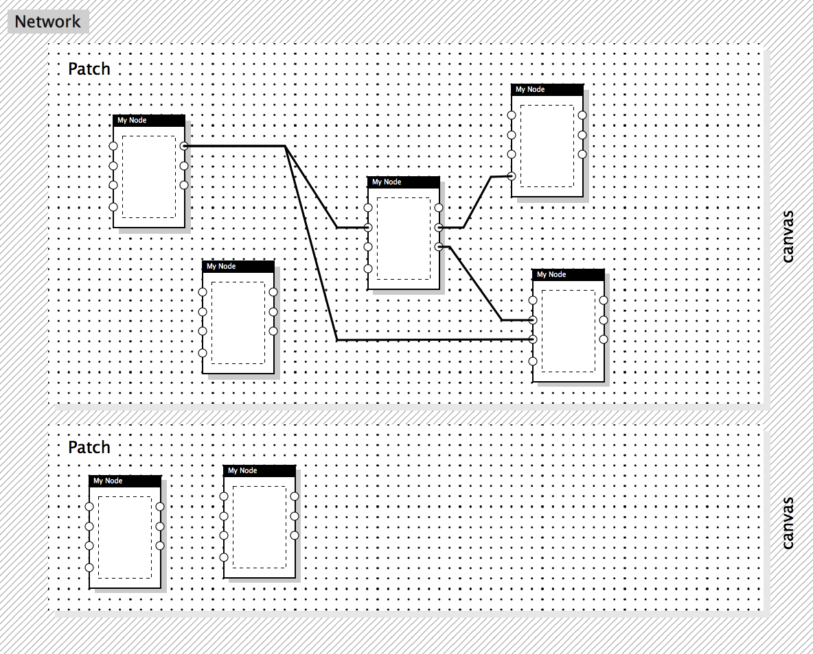
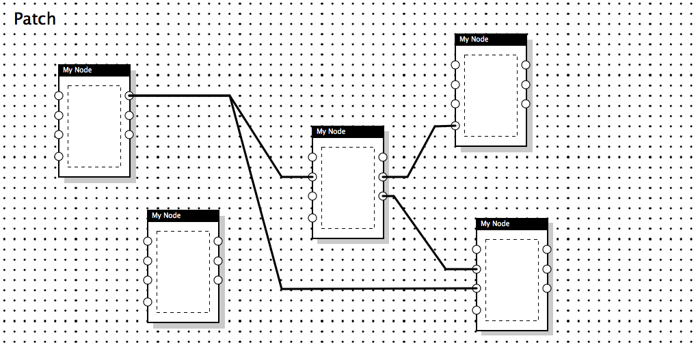
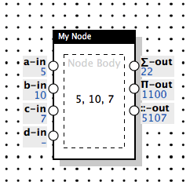
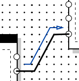
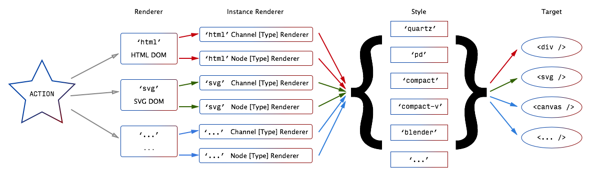
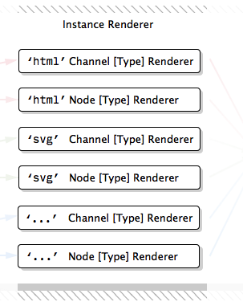
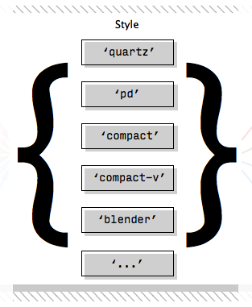

<div id="logo-patch">
    <div id="patch-target"></div>
    <svg id="planets" width="500px" height="140px"></svg>
    <!-- rpd-svg-logo: #rpd-logo 140 140 -->
</div>

<!-- TODO SVG icon patch: -->
<!-- sun and moon -->
<!-- circle particles -->
<!-- logo color shift -->

### What is RPD?

RPD is the abbreviation for _Reactive Patch Development_...

...or, actually, whatever you decide. It is the library which brings node-based user interfaces to the modern web, in full their power (when you know how to use it) and in a very elegant and minimalistic way. _Node-based_ is something like the thing you'll (probably) see above if you move your mouse cursor, or any other pointing device, above the RPD logo — (almost) nothing to do with [node.js][node-js]. Some people also say that with such user interfaces they do _Flow Programming_. If you are wondering yet, what that means, _Node-based_ interface is the one where man may visually connect different low-level components using their inputs and outputs and observe the result in real time, take <!-- consider? --> PureData, QuartzComposer, VVVV, NodeBox, Reaktor etc. for example.

RPD brings DataFlow Programming to the Web both in the _elegant_ and _minimal_ ways.

<!-- TODO: video or some example patch, processing patch from vimeo? -->

_Elegancy_ is achieved both with providing you a very simple API for building these powerful things, and (thanks to the reactive streams, powered by [Kefir.js library][kefir]) pure functional approach in the core, so it's easy for you to operate with sequences of data over time in any way you want, and also every action performed, (such as adding a node, or connecting something, or sending a value) is atomic, so it can easily be rolled back or stored in, and so restored from, some file.

<!-- an example of defining simple node (and channel?) type and connecting it to a patch,
show streams and simple values -->

_Minimalism_ is another goal of this library, which implies the RPD library size
is kept as minimal as possible, so your customer may load the interface you created using 3G internet or wi-fi limited to some very low speed. Don't ask me why may it happen, it still happens everywhere. Minimalism is here not in paranoid amounts, though&mdash;if feature requires a bit more code, or some task gets very complex with less code, we for sure will add some more code for the sake of simplicity.

The default configuration with [SVG renderer][renderer-comp-section] and [Quartz style][style-comp-section] included takes _11KB_ when compiled, minimized and gzipped! (30KB not gzipped). Though you also need [latest Kefir.js][kefir], the only required dependency to make it work, which adds just ~10KB more, since [Kefir.js author][roman-pominov] also likes minimalism in his code.

If you feel that's you know everything in this field and this library is definitely what you need (and no doubts, it is!), you may either download the [version with default configuration][download-default] or go straight to [Building Section](./sections/building) to discover how easy it is to grab a code and configure yourself a custom one. If you still feel unsafe, stay with me for a bit.

### Code Examples

#### Random Generator

Random Generator with the help of [`util`](http://..) toolkit:

<div id="example-one"></div>

```js
Rpd.renderNext('svg', document.getElementById('example-one'),
               { style: 'compact-v' });

var patch = Rpd.addPatch('Generate Random Numbers').resizeCanvas(800, 110);

// add Metro Node, it may generate `bang` signal with the requested time interval
var metroNode = patch.addNode('util/metro', 'Metro').move(40, 10);

// add Random Generator Node that will generate random numbers on every `bang` signal
var randomGenNode = patch.addNode('util/random', 'Random').move(130, 20);
randomGenNode.inlets['max'].receive(26); // set maximum value of the generated numbers

// add Log Node, which will log last results of the Random Generator Node
var logRandomNode = patch.addNode('util/log', 'Log').move(210, 60);
randomGenNode.outlets['out'].connect(logRandomNode.inlets['what']);

// define the type of the node which multiplies the incoming value by two
var multiplyTwoNode = patch.addNode('core/basic', '* 2', {
    process: function(inlets) {
        return {
            'result': (inlets.multiplier || 0) * 2
        }
    }
}).move(240, 10);
var multiplierInlet = multiplyTwoNode.addInlet('util/number', 'multiplier');
var resultOutlet = multiplyTwoNode.addOutlet('util/number', 'result');

// connect Random Generator output to the multiplying node
var logMultiplyNode = patch.addNode('util/log', 'Log').move(370, 20);
resultOutlet.connect(logMultiplyNode.inlets['what']);

// connect Random Generator output to the multiplying node
randomGenNode.outlets['out'].connect(multiplierInlet);

// finally connect Metro node to Random Generator, so the sequence starts
metroNode.outlets['out'].connect(randomGenNode.inlets['bang']);
```

#### HTML5 Canvas and Custom Toolkit

<div id="example-two"></div>

```javascript
TODO
```

### Terminology

At first, we'll define terms of node-based interfaces, the way RPD sees them, starting from the highest level (the _Network_) and going down till the lowest known level (the _Link_). If that's not very comfortable for you, you may do it in reverse direction, then please scroll down to _Link_ and then reach the top at _Network_.

<!-- TODO Image or interactive example (jsfiddle, run by click?) showing the network of simple patches -->

#### Network

</img>

_Network_ defines a system of Patches. At this level Patch may be considered as a complex procedure with several inputs and outputs and a Network is a program that uses these procedures.

Say, you define some complex functionality of a 3D vertex shader with a Patch. It has its inputs such as 3D position, color and texture coordinate of a vertex and outputs as 2D coordinate and modified color. Then you may create another “root” Patch, which allows user to apply combinations of different vertex shaders to an imported object and so re-use the Shader Patch several times in different configurations. These two Patches (first one used several times and second one used once) form a simple Network.

<!-- TODO: diagram of a vertex shader network -->

So, some Node in one Patch may represent the inputs and outputs of another Patch's copy, running in the same Network.

#### Patch

</img>

_Patch_ stores a collection of Node instances and connections between them.
The resulting structure of Nodes and connections defines the way data flows in this Patch.

<!--TODO Two nodes connected, to show inlets and outlets (run by click?) -->

#### Node

</img>

_Nodes_ are building blocks which use connections to receive any data from one nodes, modify it, and send transformed data to another Nodes. Nodes may have zero or more inputs of different types, named _Inlets_ and zero or more outputs of different types, named _Outlets_. Nodes may have a body which may represent received data or even have some controls allowing user to change it though hidden inlets.

#### Outlet

</img>

_Outlet_ is a socket of a Node designed to send outgoing data. Outlet may be connected to an Inlet of another Node or to several Inlets of other Nodes.

Type of the Outlet determines which types of values it sends.

Outlet and Inlet types are called Channel Types.

#### Inlet

</img>

_Inlet_ is a socket of a Node designed to receive incoming data. Depending on configuration, it may accept only one connection from an Outlet or any number of connections from several Outlets.

Inlet may have a default value, so it sends it to the Node when the latter is added to a Patch.

Inlet may be hidden, so it won't be visible for user, but may receive data from inputs located in the body of the Node.

Inlet may be “cold”, in contrary to “hot” by default, so it won't trigger the modifying process, but save the last value that came to this Inlet.

Inlets may accept or deny values depending on their type. Type may specify a function which will transform data before it will be sent to the Node.

#### Link

</img>

_Link_ is what connects single Outlet to single Inlet. Always one to one. It may be disabled, so it will not deliver all the data which comes inside, but keep the connection.

<!-- TODO Nodes from different toolkits -->

#### Toolkit

_Toolkit_ is a group of Node and Channel Types lying in (preferrably, but not required) one namespace. For example, [Processing.js][processing-js] Toolkit may define Nodes and Channels which control the configuration of a Processing Sketch, use and convert data types specific to Processing and so on.

<!-- TODO SVG and HTML -->

#### Rendering Flow

</img>

This sub-section is actually not about a specific Term and intended to quickly clarify how the things described below work together.

When you need to render a Patch, you need to know three things: which Renderer you want to use, which Style you prefer visually and the Target where you want everything to be injected. Style is optional, though, since `quartz` is the default one to be used, but sad things happen, and you may dislike it. So, to satisfy every taste, several Styles are included in RPD distribution. You actually may use same configuration to render several Patches, but let's leave it to [API docs](./api.html) for now.

The engine of the rendering process is Actions. They are fired on every change of the value, when new Connection between Outlet and Inlet is established, or instead someone removed the Connection, or someone moved one Node etc. To the Rendering System there is no matter who did this Action, User or API call.

> If you know what [Flux](https://facebook.github.io/flux/) or [Elm](http://elm-lang.org/) is, it is almost the same Action concept you've met there; if you don't know about both, just replace Action term with Event term here and below.

So, for example you chose `'svg'` Renderer to render your Patch. What happens then? On every user or logical Action, this Renderer is notified. Then this Renderer decides which (preferably, the tiniest one) part of the Network it should re-render. If Node or Channel (Inlet or Outlet) is required to be updated, it searches for the corresponding Node Renderer or Channel Renderer, the one assigned to this Renderer. Node/Channel Renderer can render particular type of the Node/Channel (and then it's called Node/Channel Type Renderer) or it may be overridden for the specific instance of the Node/Channel (and then it's called Node/Channel Instance Renderer). If something else was updated, Renderer re-renders this part itself, without delegation. No, actually, it sometimes passes some updates to Style, just Node/Channel Renderer step is skipped in this case.

In its turn, Node/Channel Renderer renders the body of the Node (`'svg'` Renderer uses SVG elements for that) or a value of the Channel (same, with SVG elements). Then the result of the rendering is injected into a structure, provided by selected Style.

And the final piece of DOM (or whatever) is injected into the Target, into a proper place. Target for `'html'` Renderer should be some HTML element like `<div />`, for `'svg'` Renderer it should be some SVG element, preferably `<svg>` or `<g />`, and so on.

That's it, now users sees the whole thing in dynamic.

Now, let's describe the same process from participants' points of view.

#### Renderer

</img>

_Renderer_ is a system which determines the way current Patch model is rendered. For now, there are two Renderers: HTML and SVG, they render Patches to HTML or SVG tags correspondingly. For instance, HTML Renderer renders Link connections as `span` blocks with CSS borders and SVG Renderers just draws SVG `line` tags for the same purpose.

Also, Renderer determines where new node will be placed if position was not specified.

#### Node Type/Instance Renderer

</img>

_Node Type Renderer_ builds the body of the Node and may update its content when some incoming update triggered it. Also, it may send values from inner controls to a hidden Inlets of the Node.

There should be a separate Node Type Renderer for each way to render a node, such as HTML, SVG and so on. By default, if Node can't render itself in the requested way, it is rendered as an empty Node, yet having all the defined Inlets and Outlets.

_Node Instance Renderer_ has exactly the same definition structure, it just overrides the Node Type Renderer so you can render any specific Node instance completely another way with just re-defining Type Renderer inline.

#### Channel Type/Instance Renderer

</img>

_Channel Type Renderer_ builds the Inlet/Outlet value representation and also may add the editor to a Channel value.

Editor is an optional control which lets user override the value in the Inlet.

_NB: For the moment, value editors are only supported in HTML Renderer_

_Channel Instance Renderer_ has exactly the same definition structure, it just overrides the Channel Type Renderer so you can render any specific Channel instance completely another way with just re-defining Type Renderer inline.

#### Style

</img>

_Style_ determines the look of the Patch, Node, Channel or a Link. While Renderer builds the outer structure, controls drag-n-drop and other logic, Style only determines the inner visual appearance of these elements.

#### Canvas

_Canvas_ is a place where Patch is rendered and operated. It has size and could have background color, for example. When several Patches share same target DOM element, they still have different canvases. Canvas could be an HTML5 Canvas by accident, but for sure not obligatory — this term came from [Pure Data][pure-data], the thing existed long before HTML5 and appeared just few years after first ever HTML specification.

#### Projection

<!-- IN PROGRESS -->

#### I/O Module

_I/O Module_ records every action (or only some of the actions) performed to build the Network in some specific format, so it can optionally “replay” these actions in order, using this data.

<!-- All the updates inside the Network are based on purely functional code, so there are no actual data modifications performed, only signals are sent. Among other useful things, it allows to easily record and restore things. Your code could be imperative, if you decide, but you should not modify the Network structure if you plan to share the code with others. -->

[node-js]: http://nodejs.org
[kefir]: http://rpominov.github.io/kefir/
[roman-pominov]: http://rpominov.github.io
[processing-js]: http://p5js.org
[pure-data]: http://puredata.info/

[download-default]: TODO
[building-section]: ./sections/building.html
[renderer-comp-section]: ./sections/compilation.html#renderers
[style-comp-section]: ./sections/compilation.html#styles

<script defer src="./d3.v3.min.js"></script>
<script defer src="./docs-patch.js"></script>
<script defer src="./index-patches.js"></script>
